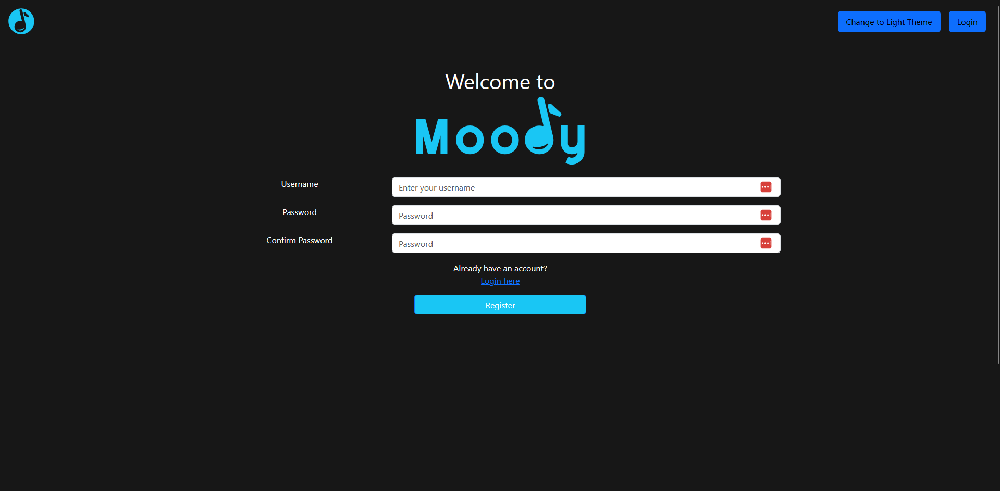

# Moody
[](https://opensource.org/licenses/MIT)
## Table of Contents
- [Description](#Description)
- [Installation](#Installation-Instructions)
- [Usage](#Usage-Instructions)
- [Credits](#Credits)
- [License](#License)
- [Features](#Features)
- [Future Plans](#Future-Plans)
- [Questions](#Questions)
- [Screenshots](#Screenshots)
## Description
This group project aims to use OpenAI API and Spotify API to collaborate with the user to generate a playlist based on the user's mood.The application will prompt the user to enter their mood, and will 'talk' to the OpenAI API to generate a list of 15 songs based on the user's mood. After recieving the data, the application will then use Spotify Web API to get the metadata of the songs from the generated list and add an option for the users to play the song from within the application.
## Installation Instructions
1. Clone the repos using ```git clone```
2. Navigate to the project directory and enter ```npm i && npm run install``` to install the project's dependencies
## Usage Instructions
### Deployed application
The deployed application will be available [here](https://moody-lawj.onrender.com/) on the Render service. As this is being hosted on Render, it will take a couple of minutes for the application to load. After waiting, just refresh the page until the website is accessible.
### Local deployment
1. To run the application, make sure the dependencies have been installed using ```npm i && npm run install```, and after it's all installed, run ```npm run start```
2. On the web browser, the application should be accessible in [http://localhost:3001](http://localhost:3001)
3. On opening the website, by default, you should be directed to the login page. As a first time run, your account does not yet exist. Click on the 'Register here' link near the bottom of the login form to navigate to the Register page.
4. Create an account with your preferred credentials. (The account will not persist after the server has been restart)
5. The website will push you to the home page where there is a prompt text box to tell you to enter your mood. Enter a mood/emotion.
6. Navigate to the Playlist page shown above, in the navigation bar.
7. Your playlist should be showing there if the API collaboration was successful.
## Credits
- [Jack Bass](https://github.com/CodingJacksFuture)
- [Lukas Imboden](https://github.com/limboden)
- Keith Sialana
## License
MIT
## Features
- Login and Register to PostgreSQL database
- Logout
- Prompting user for their mood to create a playlist
- Using OpenAI API to create a list of songs based on the user's mood
## Future Plans
- Successfully implement Spotify Web API
- Implement custom playlist creation by user's choice
- Randomize the songs recieved from OpenAI API, so the songs returned would not always be the same
## Questions
- [Keith's Github](https://github.com/keithrsialana)
- [Jack Bass](https://github.com/CodingJacksFuture)
- [Lukas Imboden](https://github.com/limboden)
- [Keith's Email](mailto:keith.sialana@hotmail.com)
## Screenshots
## Home Page

## Login Page

## Register Page

## Playlist Page

